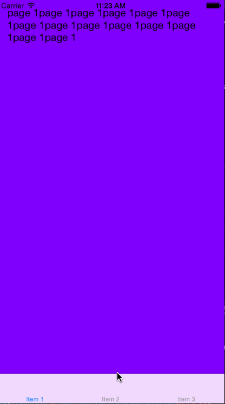
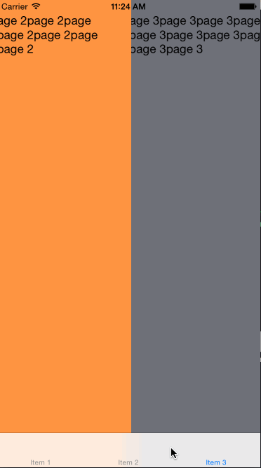

# How does it look like ?

<p align="left">
	&nbsp;
	&nbsp;
	&nbsp;		
</p>

# How to use ?

```
	UITabBarController
	#import "CHXTabBarControllerTransitioning.h"
	
	...
	
    // self.carrier = [[CHXTabBarTransitioningAnimatorCarrier alloc] initWithTabBarController:self];
    self.carrier = [[CHXTabBarTransitioningAnimatorCarrier alloc] initWithTabBarController:self transitioningAnimatorStyle:CHXTabBarTransitioningAnimatorStyleCover];
	// self.carrier.enablePanGestureRecognizer = NO;
    self.delegate = self.carrier;
	
```

